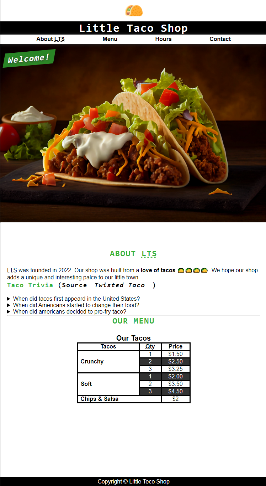

#  LITTLE TACO SHOP
---
##### *This is an HTML and CSS only project for the official website of the Little Taco Shop created by Odili Chinedum Christian.its a strict html and css only project to test my html and css skill*
---
** Table of Content:
1. [Home.](https://github.com/sp-cristiano/taco_CSS#home)
    1. [About TLS.](https://github.com/sp-cristiano/taco_CSS#about-tls)
    1. [Menu.](https://github.com/sp-cristiano/taco_CSS#our-menu)
1. [Hours.](https://github.com/sp-cristiano/taco_CSS#store-hours)
1. [Contact.](https://github.com/sp-cristiano/taco_CSS#contact-us)
##  HOME
> The home page is a simple html file consising of a welcome message, some navigation menu, internal id link to the about TLS and Our Menu link, Taco trivia and an image of Tacos with its caption
### ABOUT TLS
> The Aboult TLS is an internal link in the Home page which is linked by an id. This will allow the home page and the about TLS section to share same page.
### OUR MENU
> The Our Menu is an internal link in the Home page which is linked by an id. This will allow the home page and the Our Menu section to share same page.

---
## STORE HOURS
> The Store Hours page, just like other pages in this project is an HTML page which shows the hours of operation of the store.

---
## CONTACT US
> The Contact Us page, just like other pages in this project is an HTML page which is equiped with a form and phone number for customers to contact to the store.

